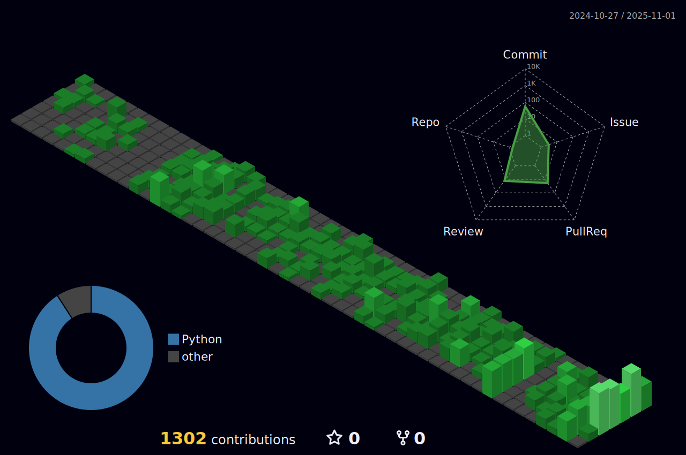

# 

## My name is Ruan Heleno, but you can call me Ruan.

### :man: &nbsp;About me

- 🎓 &nbsp; Studying Fullstack Development in Labenu  
- :dart: &nbsp; Focus on ReactJS and Javascript  
- :computer: &nbsp; Programming everyday for love  
- :world_map: &nbsp; I love travelling  

### :rocket: &nbsp;**Skills**

### :earth_americas: &nbsp;**Where to find me**

### ✉️ &nbsp;**Contact me**

### :trophy: &nbsp;Status

 
  

 &nbsp;

  
<!--  -->
